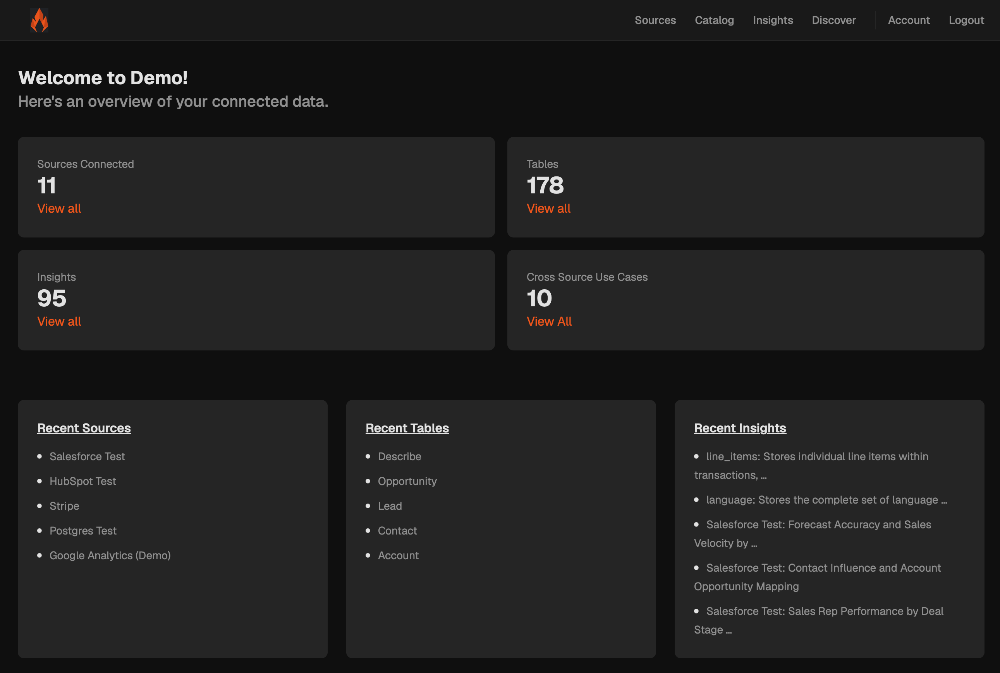
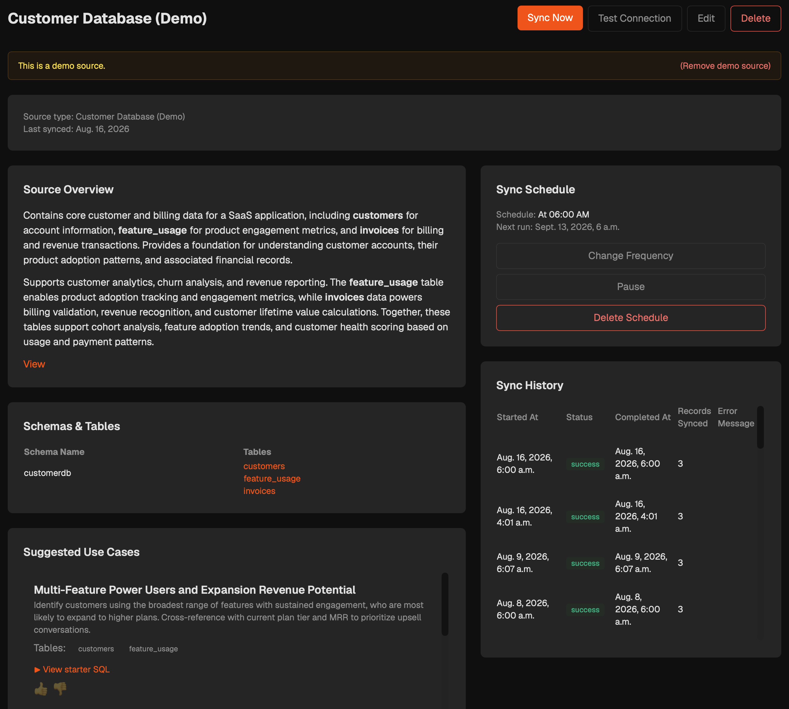
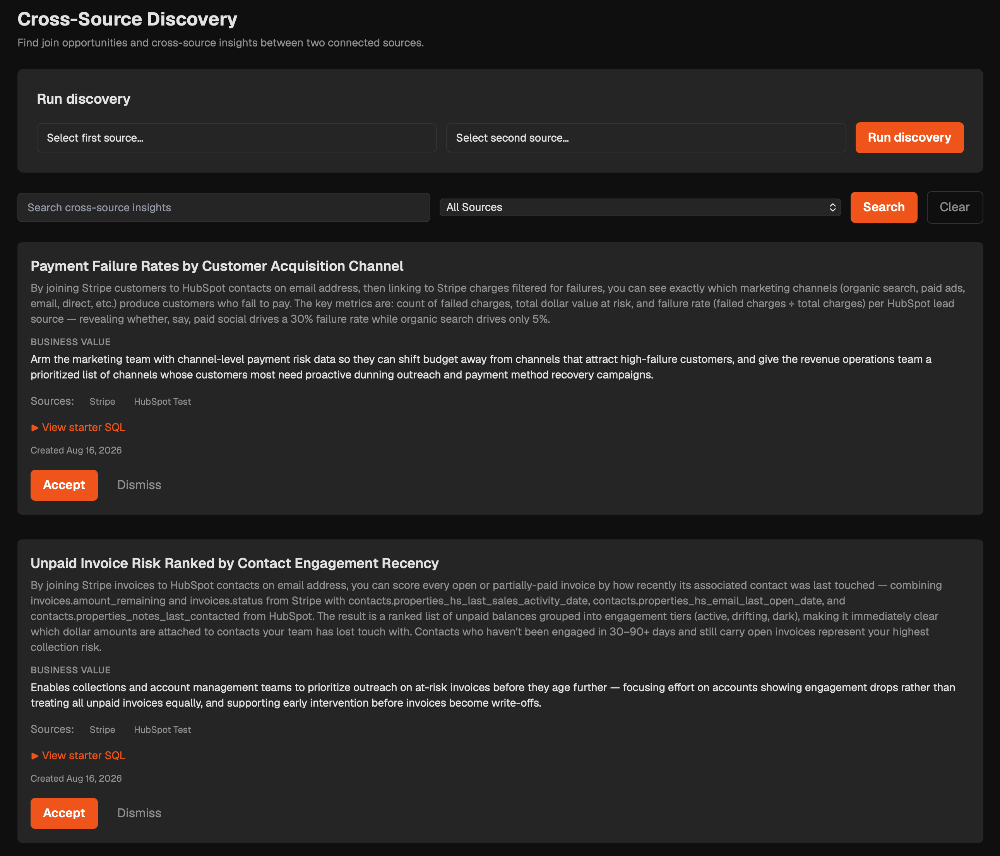
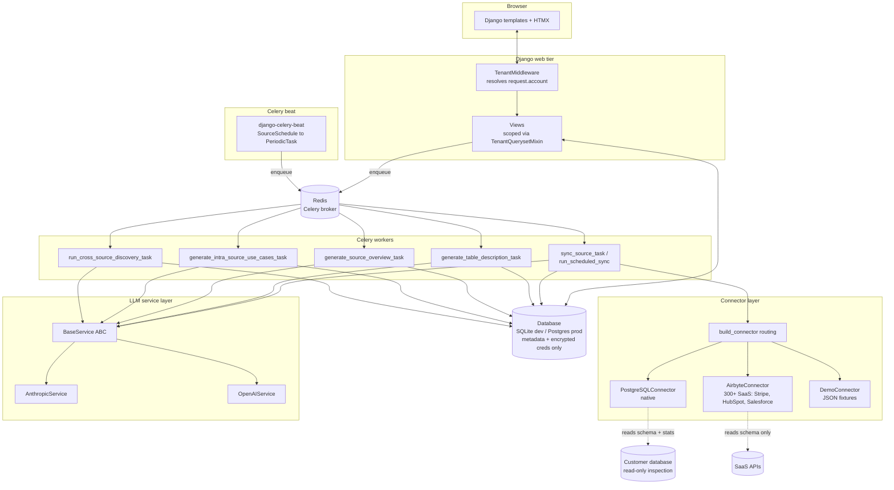
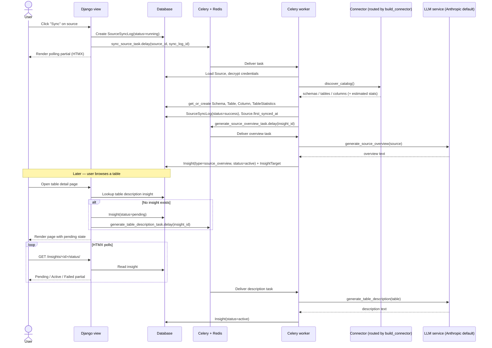
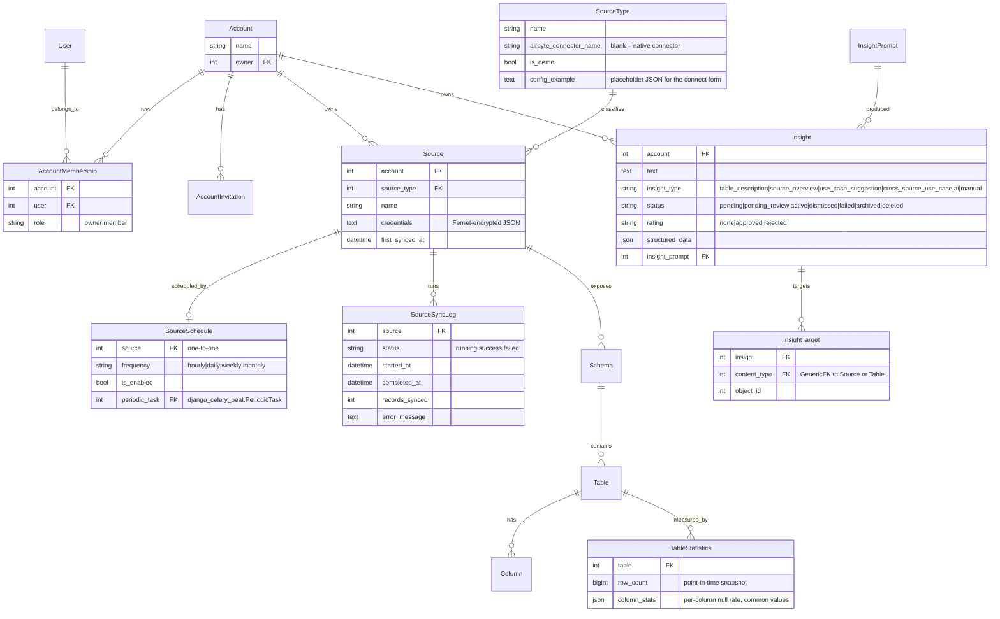

# Flint

#### Current status: MVP complete

___

### Personal Progress
* **What I learned**: This was one of my biggest learning projects, I specifically set out to go through parts of Django and Python where I did not have a lot of experience. Some key things I 
  learned include: comprehensive logging and testing, managing async tasks using Celery and redis, encryption using Fernet.
* **What I wish I had done differently**: Not leaned into abstractions too early. There are some base classes like `BaseService` where I tried to create the abstractions for my LLM services before 
  I really knew how I wanted the shape of the LLM services to look. This sort of rendered the base classes useless. I should have first implemented the LLM services and then refactored to create the abstractions.
* **What I am most proud of**: Solving a real problem that I have seen play out across working across multiple data platforms. One of the questions I have heard from customers again and again is 
  "what can I do with my data?". Flint is a tool that helps answer that question, without requiring me to know each data source in great detail.
* **What I want to learn next**: How to work with agentic development workflows. In building Flint I used Claude as a "tech lead". It helped me to architect the app and features and coached me in 
  writing the code. This was extremely useful in helping me learn but was quite slow. In my next project I want to try guiding the agents instead of the agents guiding me.

## Description

Data catalogs like Atlan and Amundsen describe *what* data exists. Flint describes what your data *means* and *how to use it*.

Flint connects to your databases and SaaS tools, discovers their schemas, and uses LLMs to generate human-readable descriptions, source overviews, and suggested analyses. Flint inspects and stores schema structure (table names, columns, types), derived statistics (row-count estimates, per-column null rates), and the insights it generates; it does not copy, query, or store your bulk row-level data.

<p align="center">
  
  <br>
  <em>The dashboard: connected sources, catalog size, and recent activity at a glance.</em>
</p>

Today Flint features:

- Connection to native PostgreSQL sources
- Connection to SaaS sources via PyAirbyte: Stripe, HubSpot, and Salesforce ship today; each is registered with a small per-source migration
- Demo mode: a Sales scenario (HubSpot, Google Analytics, and Customer Database demo sources), so you can try the product without real credentials
- Discover schemas, tables, and columns on demand or on a schedule
- Capture estimated table statistics (row counts, per-column null rates, and common values) from native sources
- Generate LLM source overviews, LLM table descriptions, and suggested intra-source use cases included starter SQL queries
- Run cross-source discovery: pick two synced sources, and an LLM pipeline finds join opportunities and proposes cross-source use cases
- Support: multi-tenant accounts with team invites (owner / member roles) and an account settings page

<table>
  <tr>
    <td width="50%"></td>
    <td width="50%"></td>
  </tr>
  <tr>
    <td><em>A source detail page: the LLM source overview, discovered schema, suggested use cases, and the sync schedule/history.</em></td>
    <td><em>Cross-source discovery: pick two synced sources and review the AI-proposed cross-source use cases.</em></td>
  </tr>
</table>

You can see Flint in action in this demo walkthrough:

<p align="center">
  <video src="https://github.com/brayden-s-haws/Flint/raw/main/devdocs/doc_images/flint_demo.mp4" controls width="75%">
    Your browser can't play this video inline —
    <a href="https://github.com/brayden-s-haws/Flint/raw/main/devdocs/doc_images/flint_demo.mp4">download or view flint_demo.mp4</a>.
  </video>
</p>

---

## Architecture

### System components



### Sync and insight data flow



### Entity relationships



All tenant-scoped models (`Source`, `SourceSchedule`, `SourceSyncLog`, `Schema`, `Table`, `Column`, `TableStatistics`, `Insight`, `InsightTarget`, `InsightPrompt`, `AccountInvitation`) carry an `account` foreign key inherited from `TenantAwareModel`. Views filter by `request.account` so accounts can never see each other's data. (`SourceType`, `Account`, and `AccountMembership` are shared / not tenant-scoped.)

---

## Tech stack

| Layer | Choice |
|---|---|
| Backend | Django 6.0.2, Python 3.12 |
| Frontend | Django templates + HTMX, Tailwind CSS (production build, not CDN) |
| Database | SQLite (dev), PostgreSQL (prod) |
| Background tasks | Celery 5.4 + Redis |
| Scheduled syncs | `django-celery-beat` 2.9 + `croniter` (DB-backed periodic tasks) |
| LLM providers | Anthropic (`anthropic` 0.86) and OpenAI (`openai` 2.29) behind a `BaseService` abstraction — Anthropic is the runtime default; a fast model tier handles most generation, a quality tier writes cross-source use cases |
| Native source connector | `psycopg2-binary` (PostgreSQL) |
| SaaS source connectors | PyAirbyte (`airbyte` 0.53) — schema-only adapter for 300+ Airbyte sources; `uv` provisions venv-based connectors (e.g. Salesforce) |
| Credential encryption | Fernet (`cryptography`) |
| Insight rendering | `markdown` (LLM markdown → HTML) |

---

## Project structure

```
Flint/
├── Flint/                     # Project config: settings, urls, celery, wsgi/asgi
├── apps/
│   ├── core/                  # Base models, mixins, dashboard
│   ├── users/                 # Custom email-based User model, auth views
│   ├── accounts/              # Account, AccountMembership, AccountInvitation, TenantMiddleware
│   ├── sources/               # SourceType, Source, sync logs, schedules, connectors, encryption
│   ├── catalog/               # Schema, Table, Column, TableStatistics, browsable views
│   └── insights/              # Insight, InsightTarget, InsightPrompt, LLM service layer
├── templates/                 # Project-wide HTML templates and partials
├── static/                    # Tailwind input.css, compiled output.css, images
├── demo/                      # Demo connector + JSON datasets for demo mode
├── devdocs/                   # Architecture, models, app docs, feature docs, roadmap
├── manage.py
├── requirements.txt
├── package.json               # Tailwind tooling
├── tailwind.config.js
└── .env.example
```

### Apps at a glance

- **core** — `TimeStampedModel` and `TenantAwareModel` abstract bases, `TenantQuerysetMixin` for account-scoped querysets, dashboard view with counts, markdown template filters.
- **users** — Custom `User` model with email login, register / login / logout views, and the domain-based registration guard.
- **accounts** — `Account`, `AccountMembership` (owner / member roles), `AccountInvitation`. Owns `TenantMiddleware` (attaches `request.account`) and the signal that auto-creates an account + owner membership on registration. Account settings page, invite send / accept flows.
- **sources** — `SourceType`, `Source` (credentials stored Fernet-encrypted), `SourceSyncLog`, `SourceSchedule`. Owns the connector plugin system (`apps/sources/connectors/`: `BaseConnector` → `PostgreSQLConnector`, `AirbyteConnector`, plus `build_connector` routing), the credential encryption helpers (`apps/sources/encryption.py`), scheduled syncs (`apps/sources/scheduling.py` + `django-celery-beat`), and the `sync_source_task` / `run_scheduled_sync` Celery tasks.
- **catalog** — `Schema`, `Table`, `Column`, `TableStatistics`. Browsable views for navigating discovered metadata (search + source filter).
- **insights** — `Insight`, `InsightTarget` (GenericFK to Source or Table), `InsightPrompt`. Owns the LLM provider abstraction (`apps/insights/services/`), the prompt templates (`apps/insights/prompts/`), the async description / overview / use-case tasks, and the manual cross-source discovery pipeline (`apps/insights/cross_source_pipeline.py`) with its accept / dismiss review queue. Endpoints support HTMX status polling and retry.

---

## Setup

### Prerequisites

- Python 3.12 (not 3.13 — the PyAirbyte connector stack has no Python 3.13 wheels yet)
- Node.js 18+ (for the Tailwind build)
- Redis (for Celery). On macOS: `brew install redis && brew services start redis`

### Local install

```bash
# 1. Clone and enter the repo
git clone <your-fork-url> Flint
cd Flint

# 2. Create + activate a virtualenv
python -m venv .venv
source .venv/bin/activate

# 3. Install Python deps
pip install -r requirements.txt

# 4. Install Tailwind tooling
npm install

# 5. Create your env file
cp .env.example .env
```

Edit `.env` and fill in:

- `SECRET_KEY` — any random string for local dev
- `ENCRYPTION_KEY` — a Fernet key. Generate one with:
  ```bash
  python -c "from cryptography.fernet import Fernet; print(Fernet.generate_key().decode())"
  ```
- `OPENAI_API_KEY` and/or `ANTHROPIC_API_KEY` — at least one is needed for insight generation. Anthropic is the default provider for auto-generated insights.
- `DEBUG=True` for local development.
- `DATABASE_URL` and `CELERY_BROKER_URL` / `CELERY_RESULT_BACKEND` are optional — defaults work for SQLite + local Redis on port 6379.

Then:

```bash
# 6. Apply migrations
python manage.py migrate

# 7. (Optional) Create a superuser for /admin/
python manage.py createsuperuser

# 8. Verify Redis is up
redis-cli ping   # expects PONG
```

### Running the stack

You need **three processes** running together (four if you use scheduled syncs). Use separate terminals, each with the venv activated:

```bash
# Terminal 1 — Django dev server
python manage.py runserver

# Terminal 2 — Tailwind watcher (rebuilds static/css/output.css on change)
npm run watch:css

# Terminal 3 — Celery worker (handles sync and insight generation)
celery -A Flint worker -l info

# Terminal 4 (optional) — Celery beat, only needed to run scheduled syncs
celery -A Flint beat -l info
```

Open <http://localhost:8000>, register an account, connect a source, click **Sync**, then browse the discovered schema. Opening a table for the first time will kick off async description 
generation, the page will show a pending state and update in place when the description is ready.

### Try demo mode (no credentials needed)

From the sources page, use the **Load demo data** flow to load the Sales scenario, three demo sources (HubSpot, Google Analytics, and Customer Database). These use the demo connector backed by JSON 
fixtures in `demo/data/sales/`, so you can exercise the full sync → catalog → insight → cross-source discovery pipeline without connecting a real database.

---

## Adding an Airbyte-backed source

Flint reaches 300+ SaaS sources through the PyAirbyte adapter (`AirbyteConnector`). Adding one needs **no new connector code**, you register a `SourceType` row with a small data migration, and 
`build_connector` routes any `SourceType` whose `airbyte_connector_name` is set through the Airbyte adapter automatically.

### 1. Spike the connector to learn its config shape

Before writing the migration, inspect the connector's config schema so you know which fields its `config_example` placeholder needs. Run this in the Django shell:

```python
python manage.py shell
>>> import airbyte as ab
>>> src = ab.get_source("source-salesforce")   # first-use install: slow, needs network
>>> src.config_spec                              # the connector's config JSON schema: fields, types, required flags
```

`ab.get_source(<connector-id>)` triggers PyAirbyte's first-use installation of that connector, which is why Flint does **not** call `config_spec` live inside the connect form and instead 
ships a static `config_example`. `src.config_spec` returns the connector's config schema; translate it into the placeholder JSON for the new source type. Swap `"source-salesforce"` for whatever connector you're onboarding (connector ids look like `source-stripe`, `source-hubspot`, `source-salesforce`).

### 2. Add a per-source data migration

Register the source type in its own data migration under `apps/sources/migrations/`, following the existing templates:

- `0008_seed_stripe_source_type.py` — Stripe (`source-stripe`)
- `0011_seed_hubspot_source_type.py` — HubSpot (`source-hubspot`)
- `0012_seed_salesforce_source_type.py` — Salesforce (`source-salesforce`)

Each `get_or_create` spawns a `SourceType` with:

- `name` — the display name shown in the connect form
- `airbyte_connector_name` — the PyAirbyte connector id (e.g. `source-stripe`); setting this is what routes the source through `AirbyteConnector`
- `config_example` — placeholder JSON derived from the `config_spec` spike, shown as help text on the connect form

Run `python manage.py migrate`, and the new source type appears in the connect-source form. The Airbyte adapter is **schema-only** — it discovers streams as tables and JSON-schema properties as columns but does not read row-level data or compute statistics.

> **Note:** some connectors (e.g. Salesforce) install into their own `uv`-managed virtualenv (`.venv-source-salesforce/`, enabled via `AIRBYTE_NO_UV=1` in `settings.py`).

---

## Common commands

```bash
# Dev server
python manage.py runserver

# Tailwind (watch in dev, build before deploy)
npm run watch:css
npm run build:css

# Celery worker (and beat scheduler for scheduled syncs)
celery -A Flint worker -l info
celery -A Flint beat -l info

# Redis health check
redis-cli ping

# Migrations
python manage.py makemigrations
python manage.py migrate

# Tests (the full suite runs eager / mocked at the external seams)
python manage.py test
python manage.py test apps.<app_name>.tests.<TestClass>

# Django shell
python manage.py shell

# New app (place under apps/)
cd apps && python ../manage.py startapp <app_name>
```

See [`CLAUDE.md`](CLAUDE.md) for the full development workflow, code standards (type hints required, form styling conventions), and other conventions.

---

## Key patterns

- **Multi-tenancy.** Every tenant-scoped model carries an `account` foreign key via `TenantAwareModel` (`apps/core/models.py`). `TenantMiddleware` (`apps/accounts/middleware.py`) resolves `request.account` from the logged-in user's membership; `TenantQuerysetMixin` (`apps/core/mixins.py`) filters querysets in class-based views. Any new view must scope its data by `request.account`.

- **Connector plugin system.** Source adapters live under `apps/sources/connectors/`. Implement `BaseConnector` (`base.py`) with `test_connection`, `discover_catalog`, and `get_table_metadata`. `build_connector` (`registry.py`) routes a `SourceType` to the `AirbyteConnector` when its `airbyte_connector_name` is set, otherwise to a native connector registered by name. Credentials are decrypted only at connector instantiation and never logged.

- **Scheduled syncs.** A `SourceSchedule` (one-to-one with `Source`; frequency hourly / daily / weekly / monthly) is backed by a `django-celery-beat` `PeriodicTask`. Helpers in `apps/sources/scheduling.py` create / update / toggle / delete that periodic task; the beat scheduler enqueues `run_scheduled_sync`, which opens a sync log and delegates to `sync_source_task`.

- **LLM provider abstraction.** `get_service(provider)` (`apps/insights/services/provider.py`) returns an `AnthropicService` or `OpenAIService`, both subclasses of `BaseService`; Anthropic is the runtime default. Prompts live in `apps/insights/prompts/`. Add a new provider by subclassing `BaseService` and registering it in the factory.

- **Async on first view.** Long-running LLM work runs in Celery. Views create an `Insight` with `status='pending'`, enqueue the task, and render a template that polls `insight_status` via HTMX until the status flips to `active` or `failed`. The retry endpoint resets the insight and re-enqueues the task.

- **Cross-source discovery is manual and single-pair.** The user picks two synced sources; the pipeline in `apps/insights/cross_source_pipeline.py` runs relationship discovery → hypotheses → cross-source use cases and stores results as `cross_source_use_case` insights in `pending_review` for accept / dismiss. There is no autonomous agent or scheduled discovery run.

- **Pass IDs to Celery tasks, never ORM objects.** Tasks are serialized as JSON and would fail on Django model instances. All tasks in this project take primary keys and re-fetch inside the worker.

- **Credentials never leave the database in plaintext.** `apps/sources/encryption.py` wraps Fernet. The `ENCRYPTION_KEY` must be a valid Fernet key set in the environment; rotating it requires re-encrypting stored credentials.

---

## Roadmap

Flint is actively developed; this README documents only what's built today. The full post-MVP backlog lives in [`devdocs/appdocs/post_mvp.md`](devdocs/appdocs/post_mvp.md), and longer-horizon ideas in [`devdocs/potential_features.md`](devdocs/potential_features.md).

---

## Further reading

- [`CLAUDE.md`](CLAUDE.md): working style and code standards
- [`devdocs/architecture.md`](devdocs/architecture.md): full architecture deep dive
- [`devdocs/models.md`](devdocs/models.md): complete model reference
- [`devdocs/appdocs/`](devdocs/appdocs/): per-app checklists and status
- [`devdocs/featuredocs/`](devdocs/featuredocs/): per-feature implementation notes