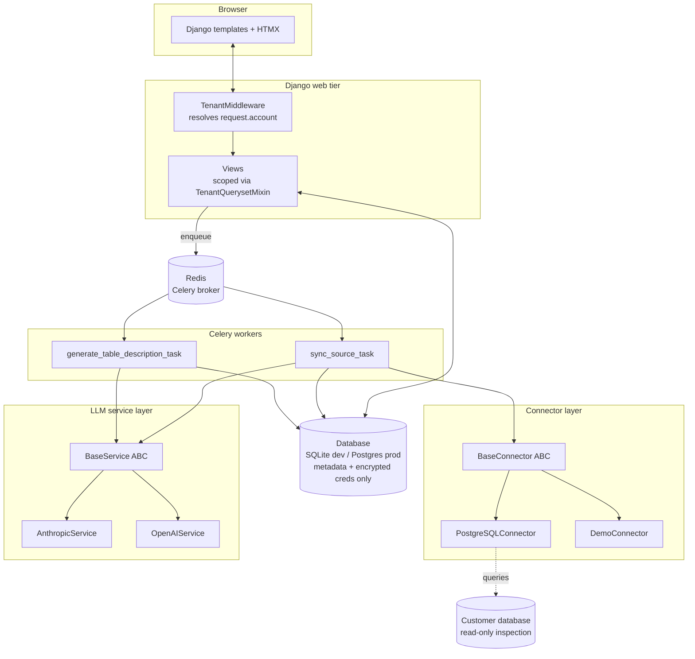
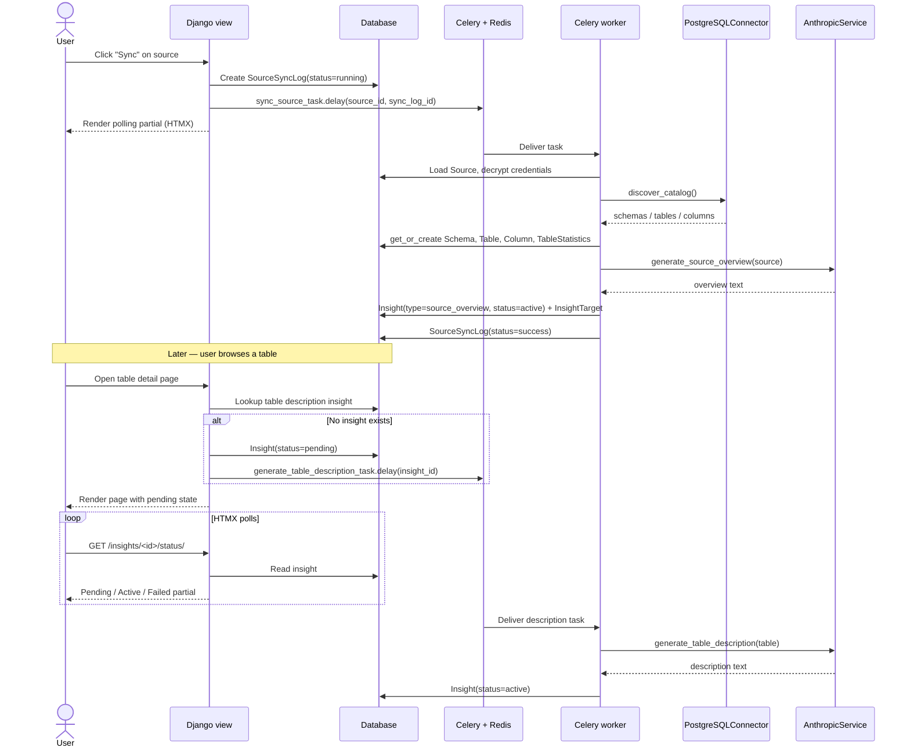
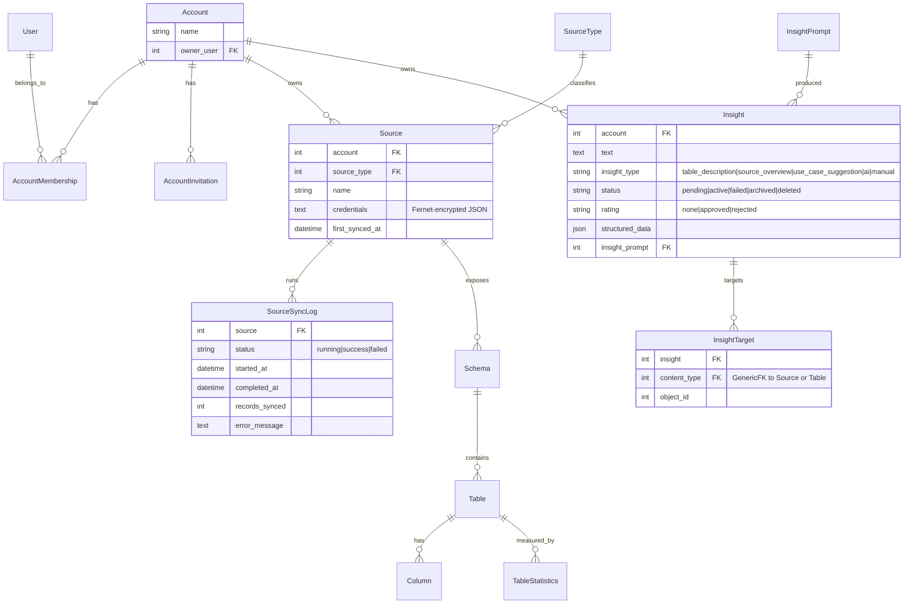

# Flint

A data intelligence platform that inspects databases and APIs to generate metadata insights — without storing your data.

**Status:** MVP complete. Actively developing post-MVP features (see [Roadmap](#roadmap)).

---

## What is Flint?

Data catalogs like Atlan, Alation, and Secoda describe *what* data exists. Flint describes what your data *means* and *how to use it*.

Flint connects to your databases, discovers their schemas, and uses LLMs to generate human-readable descriptions, source overviews, and suggested analyses. It is strictly metadata-first — Flint never copies, queries, or stores your row-level data. Only schema structure (table names, columns, types) is inspected, and only that structure plus the generated insights are persisted.

Today, Flint can:

- Connect to PostgreSQL sources (credentials encrypted at rest with Fernet)
- Discover schemas, tables, and columns on demand
- Generate an LLM source overview the first time a source syncs
- Generate an LLM table description the first time you open a table (async, with HTMX polling for the loading state)
- Generate suggested analytical use cases per source, rate-limited to once per 24 hours
- Let you rate insights (approve / reject) to refine what's shown
- Show a demo mode pre-loaded with HubSpot, Google Analytics, and Customer Database scenarios so you can try the product without real credentials
- Support multi-tenant accounts with team invites and roles

---

## Architecture

### System components



### Sync and insight data flow



### Entity relationships



All tenant-scoped models (`Source`, `Schema`, `Table`, `Column`, `TableStatistics`, `Insight`, `InsightTarget`, `InsightPrompt`, `SourceSyncLog`) carry an `account` foreign key inherited from `TenantAwareModel`. Views filter by `request.account` so accounts can never see each other's data.

---

## Tech stack

| Layer | Choice |
|---|---|
| Backend | Django 6.0.2, Python 3.12 |
| Frontend | Django templates + HTMX, Tailwind CSS (production build, not CDN) |
| Database | SQLite (dev), PostgreSQL (prod) |
| Background tasks | Celery 5.4 + Redis |
| LLM providers | Anthropic (`anthropic` 0.86) and OpenAI (`openai` 2.29), both behind a `BaseService` abstraction |
| Credential encryption | Fernet (`cryptography`) |
| Native source connector | `psycopg2-binary` (PostgreSQL) |

---

## Project structure

```
Flint/
├── Flint/                     # Project config: settings, urls, celery, wsgi/asgi
├── apps/
│   ├── core/                  # Base models, mixins, dashboard
│   ├── users/                 # Custom email-based User model, auth views
│   ├── accounts/              # Account, AccountMembership, AccountInvitation, TenantMiddleware
│   ├── sources/               # SourceType, Source, sync logs, connectors, encryption
│   ├── catalog/               # Schema, Table, Column, TableStatistics, browsable views
│   └── insights/              # Insight, InsightTarget, InsightPrompt, LLM service layer
├── templates/                 # Project-wide HTML templates and partials
├── static/                    # Tailwind input.css, compiled output.css, images
├── demo/                      # Demo connector + JSON datasets for demo mode
├── devdocs/                   # Architecture, models, app docs, feature docs, roadmap
├── manage.py
├── requirements.txt
├── package.json               # Tailwind tooling
├── tailwind.config.js
└── .env.example
```

### Apps at a glance

- **core** — `TimeStampedModel` and `TenantAwareModel` abstract bases, `TenantQuerysetMixin` for account-scoped querysets, dashboard view with counts.
- **users** — Custom `User` model with email login, register / login / logout views.
- **accounts** — `Account`, `AccountMembership`, `AccountInvitation`. Owns `TenantMiddleware` (attaches `request.account`) and the signal that auto-creates a membership on registration. Settings page, invite send / accept flows.
- **sources** — `SourceType`, `Source` (credentials stored Fernet-encrypted), `SourceSyncLog`. Owns the connector plugin system (`apps/sources/connectors/`), the credential encryption helpers (`apps/sources/encryption.py`), and the `sync_source_task` Celery task.
- **catalog** — `Schema`, `Table`, `Column`, `TableStatistics`. Browsable views for navigating discovered metadata.
- **insights** — `Insight`, `InsightTarget` (GenericFK to Source or Table), `InsightPrompt`. Owns the LLM provider abstraction (`apps/insights/services/`), the prompt templates (`apps/insights/prompts/`), and the async description and use-case generation tasks. Endpoints support HTMX status polling and retry.

---

## Setup

### Prerequisites

- Python 3.12 (not 3.13 — the PyAirbyte connector stack has no Python 3.13 wheels yet)
- Node.js 18+ (for the Tailwind build)
- Redis (for Celery). On macOS: `brew install redis && brew services start redis`

### Local install

```bash
# 1. Clone and enter the repo
git clone <your-fork-url> Flint
cd Flint

# 2. Create + activate a virtualenv
python -m venv .venv
source .venv/bin/activate

# 3. Install Python deps
pip install -r requirements.txt

# 4. Install Tailwind tooling
npm install

# 5. Create your env file
cp .env.example .env
```

Edit `.env` and fill in:

- `SECRET_KEY` — any random string for local dev
- `ENCRYPTION_KEY` — a Fernet key. Generate one with:
  ```bash
  python -c "from cryptography.fernet import Fernet; print(Fernet.generate_key().decode())"
  ```
- `OPENAI_API_KEY` and/or `ANTHROPIC_API_KEY` — at least one is needed for insight generation. Anthropic is currently the default provider for auto-generated insights.
- `DEBUG=True` for local development.
- `DATABASE_URL` and `CELERY_BROKER_URL` / `CELERY_RESULT_BACKEND` are optional — defaults work for SQLite + local Redis on port 6379.

Then:

```bash
# 6. Apply migrations
python manage.py migrate

# 7. (Optional) Create a superuser for /admin/
python manage.py createsuperuser

# 8. Verify Redis is up
redis-cli ping   # expects PONG
```

### Running the stack

You need **three processes** running together. Use three terminals (each with the venv activated):

```bash
# Terminal 1 — Django dev server
python manage.py runserver

# Terminal 2 — Tailwind watcher (rebuilds static/css/output.css on change)
npm run watch:css

# Terminal 3 — Celery worker (handles sync and insight generation)
celery -A Flint worker -l info
```

Open <http://localhost:8000>, register an account, connect a source, click **Sync**, then browse the discovered schema. Opening a table for the first time will kick off async description generation — the page will show a pending state and update in place when the description is ready.

### Try demo mode (no real credentials needed)

From the sources page, use the **Load demo data** flow to add pre-built HubSpot, Google Analytics, or Customer Database scenarios. These use the demo connector backed by JSON fixtures in `demo/data/`, so you can exercise the full sync → catalog → insight pipeline without connecting a real database.

---

## Common commands

```bash
# Dev server
python manage.py runserver

# Tailwind (watch in dev, build before deploy)
npm run watch:css
npm run build:css

# Celery worker (and optional beat scheduler when periodic tasks land)
celery -A Flint worker -l info
celery -A Flint beat -l info

# Redis health check
redis-cli ping

# Migrations
python manage.py makemigrations
python manage.py migrate

# Tests
python manage.py test
python manage.py test apps.<app_name>.tests.<TestClass>

# Django shell
python manage.py shell

# New app (place under apps/)
cd apps && python ../manage.py startapp <app_name>
```

See [`CLAUDE.md`](CLAUDE.md) for the full development workflow, code standards (type hints required, form styling conventions), and other conventions.

---

## Key patterns

- **Multi-tenancy.** Every tenant-scoped model carries an `account` foreign key via `TenantAwareModel` (`apps/core/models.py`). `TenantMiddleware` (`apps/accounts/middleware.py`) resolves `request.account` from the logged-in user; `TenantQuerysetMixin` (`apps/core/mixins.py`) filters querysets in class-based views. Any new view must scope its data by `request.account`.

- **Connector plugin system.** Sources adapters live under `apps/sources/connectors/`. Implement `BaseConnector` (`base.py`) with `test_connection`, `discover_catalog`, and `get_table_metadata`, then register the class in `registry.py` keyed by `SourceType.name`. Credentials are decrypted only at connector instantiation and never logged.

- **LLM provider abstraction.** `get_service(provider)` (`apps/insights/services/provider.py`) returns an `AnthropicService` or `OpenAIService`, both subclasses of `BaseService`. Prompts live in `apps/insights/prompts/`. Add a new provider by subclassing `BaseService` and registering it in the factory.

- **Async on first view.** Long-running LLM work runs in Celery. Views create an `Insight` with `status='pending'`, enqueue the task, and render a template that polls `insight_status` via HTMX until the status flips to `active` or `failed`. The retry endpoint resets the insight and re-enqueues the task.

- **Pass IDs to Celery tasks, never ORM objects.** Tasks are serialized as JSON and would fail on Django model instances. All tasks in this project take primary keys and re-fetch inside the worker.

- **Credentials never leave the database in plaintext.** `apps/sources/encryption.py` wraps Fernet. The `ENCRYPTION_KEY` must be a valid Fernet key set in the environment; rotating it requires re-encrypting stored credentials.

---

## Roadmap

The detailed post-MVP backlog lives in [`devdocs/appdocs/post_mvp.md`](devdocs/appdocs/post_mvp.md). At a glance:

- **Phase 2 (complete):** Account settings, team invites, insight ratings, Celery + Redis, async-on-first-view table descriptions, Tailwind production build.
- **Phase 3 (in progress):** Scheduled syncs (item #10, up next), agentic cross-source discovery, demo mode auto-trigger.
- **Phase 4:** PyAirbyte adapter, SaaS connectors (HubSpot, Salesforce, Stripe; later Google Analytics, Shopify, Zendesk, etc.), warehouse connectors (Snowflake, BigQuery, Redshift), a queries app (natural-language to SQL), a query client UI, an ERD viewer, and the ontology app.
- **Phase 5:** Multi-account switching and richer role-based permissions; ontology Phases 2–6.

---

## Further reading

- [`CLAUDE.md`](CLAUDE.md) — working style and code standards
- [`devdocs/architecture.md`](devdocs/architecture.md) — full architecture deep dive
- [`devdocs/models.md`](devdocs/models.md) — complete model reference
- [`devdocs/appdocs/`](devdocs/appdocs/) — per-app checklists and status
- [`devdocs/featuredocs/`](devdocs/featuredocs/) — per-feature implementation notes
- [`devdocs/appdocs/post_mvp.md`](devdocs/appdocs/post_mvp.md) — phased feature roadmap
