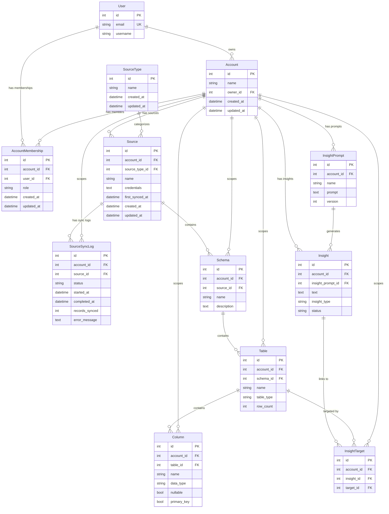

# Flint Architecture

## Project Overview

Flint is a data intelligence platform that inspects databases and APIs to generate metadata insights without storing actual data. It's positioned in the data catalog/observability space alongside tools like Atlan, Alation, Monte Carlo, and Secoda, but with a focus on **intelligence generation** rather than just cataloging.

**Key Decisions:**
- **Frontend**: Django templates (server-rendered, simpler for solo dev)
- **LLM**: Both OpenAI + Anthropic with provider abstraction
- **Team**: Solo developer (keep architecture simple)

---

## Django Apps Structure

```
Flint/
├── Flint/              # Project config (existing)
├── apps/
│   ├── core/               # Shared utilities, base models, tenant middleware
│   ├── accounts/           # Multi-tenancy, organizations
│   ├── users/              # Custom user model, authentication
│   ├── sources/            # Data source connections, connectors
│   ├── catalog/            # Tables, columns, schemas, statistics
│   ├── insights/           # LLM-generated insights, insight builder
│   └── api/                # REST API (v1) - for future integrations
```

### Future Apps (Post-MVP)
- `lineage/` - Data lineage tracking
- `queries/` - SQL query builder, saved queries
- `diagrams/` - ERD generation, Mermaid diagrams
- `observability/` - Data quality, anomaly detection

---

## Core Models

### accounts app
| Model | Purpose |
|-------|---------|
| **Account** | Tenant/organization - all resources scoped here |
| **AccountMembership** | Links users to accounts with roles (owner/admin/member/viewer) |
| **AccountInvitation** | Pending team invitations |

### users app
| Model | Purpose |
|-------|---------|
| **User** | Custom user model (email-based auth), can belong to multiple accounts |

### sources app
| Model | Purpose |
|-------|---------|
| **SourceType** | Registry of supported connectors (PostgreSQL, HubSpot, etc.) |
| **Source** | A connected data source for an account (encrypted credentials) |
| **SourceSyncLog** | History of sync attempts with metrics |

### catalog app
| Model | Purpose |
|-------|---------|
| **Schema** | Schema/namespace within a source |
| **Table** | Table/view/API entity metadata (NOT actual data) |
| **Column** | Column metadata, types, constraints, relationships |
| **TableStatistics** | Snapshot-based stats (row counts, column stats) |

### insights app
| Model | Purpose |
|-------|---------|
| **Insight** | LLM-generated or manual insight content |
| **InsightTarget** | Links insights to sources/tables/columns (polymorphic) |
| **InsightPrompt** | Versioned LLM prompts for generation |
| **InsightBuilder** | User-created cross-source exploration sessions |

### Model Relationship Diagram



> **Note:** `AccountInvitation`, `TableStatistics`, and `InsightBuilder` are planned (see model tables above) but not yet implemented.

---

## Key Architectural Decisions

### Multi-Tenancy: Shared Database with Tenant Column
- All tenant-scoped models have `account` foreign key
- Tenant middleware resolves account from user context
- Simpler than schema-per-tenant, sufficient for metadata storage
- For solo dev: Start with simple user->account 1:1, expand later

### Connector Strategy: Hybrid Airbyte + Native

We use a hybrid approach combining Airbyte connectors with custom-built native connectors:

**Airbyte Integration (Primary)**
- Leverage Airbyte's 300+ pre-built, maintained connectors
- Use **PyAirbyte** library to run connectors as Python code (no separate Airbyte server needed for MVP)
- Airbyte handles OAuth flows, rate limiting, pagination, schema discovery
- Covers most SaaS sources: Salesforce, HubSpot, Stripe, Shopify, etc.
- Option to run full Airbyte OSS later for production workloads

**Native Connectors (When Needed)**
- Build custom connectors for specialized metadata extraction
- PostgreSQL native connector for MVP (deeper introspection than Airbyte provides)
- Use when Airbyte connector lacks metadata we need (constraints, indexes, comments)
- Abstract `BaseConnector` class with standard interface
- `ConnectorRegistry` for unified lookup across both types

**Connector Interface**
```python
class BaseConnector:
    def test_connection(self) -> bool
    def discover_catalog(self) -> list[Schema]
    def get_table_metadata(self, table) -> TableMetadata
    def get_sample_data(self, table, limit=100) -> list[dict]  # For LLM context
```

**Credential Storage**
- Credentials encrypted with Fernet, keys from environment
- Airbyte connectors use their native config format
- Native connectors use our encrypted JSON storage

### LLM Integration (Both Providers)
- Provider abstraction layer supporting OpenAI and Anthropic
- Config to select default provider per insight type
- Versioned prompts stored in database for iteration
- Caching layer for repeated insight requests
- Sync calls initially (simpler), Celery tasks for batch operations

### Frontend: Django Templates
- Server-rendered HTML with Django template system
- HTMX for dynamic interactions without full SPA complexity
- Tailwind CSS or similar for styling
- Admin-style interface for data management
- Can add API endpoints for future SPA/mobile if needed

### Background Tasks: Celery + Redis
- Celery + Redis are wired up post-MVP; see `devdocs/featuredocs/celery-and-redis-setup.md` for the full setup
- Celery app at `Flint/celery.py`, tasks at `apps/<app>/tasks.py` (auto-discovered)
- Redis runs as a Homebrew service locally (default port 6379); managed Redis when deployed
- Source sync is the proof-of-concept conversion; other long-running operations (LLM source overview, use case generation) stay synchronous for now and migrate per-feature when revisited

---

## Connector Roadmap

### Phase 1 (MVP)
- **PostgreSQL** (Native) - Custom connector for deep metadata extraction

### Phase 2 (Priority)
- **HubSpot** (Airbyte) - CRM/marketing data
- **Google Analytics** (Airbyte) - Web analytics
- **MySQL** (Airbyte or Native) - Evaluate Airbyte vs custom

### Phase 3 (Data Warehouses via Airbyte)
- **Snowflake** - Data warehouse
- **BigQuery** - Google data warehouse
- **Redshift** - AWS data warehouse

### Phase 4+ (Airbyte Connectors)
With PyAirbyte integration, we get immediate access to 300+ sources:

**Databases:** SQL Server, Oracle, MongoDB, DynamoDB, Databricks, ClickHouse

**CRM/Sales:** Salesforce, Pipedrive, Close, Copper

**Marketing:** Mailchimp, Klaviyo, Braze, Marketo

**Payments:** Stripe, Square, PayPal

**E-commerce:** Shopify, WooCommerce, Amazon Seller

**Support:** Zendesk, Intercom, Freshdesk

**Analytics:** Mixpanel, Amplitude, Segment, Heap

**Productivity:** Airtable, Notion, Asana, Jira, Linear

**File/Storage:** S3, GCS, Google Sheets, Excel

**ETL/Pipelines:** dbt Cloud, Fivetran (sync metadata)

### Native vs Airbyte Decision Criteria

**Default rule (decided 2026-08):** **databases and data warehouses default to a native connector; SaaS/APIs go through the Airbyte adapter.** Databases and warehouses maintain their own statistics catalogs — Postgres `pg_class`/`pg_stats`, MySQL `information_schema.TABLES`/histograms, Snowflake & BigQuery `INFORMATION_SCHEMA` row counts, Redshift `svv_table_info`, etc. — so a native connector can pull **row counts, column statistics, and FK constraints cheaply by reading metadata** (no data read). The Airbyte adapter exposes **stream schema only** and cannot get these, even for a database source. Those stats + constraints feed insights and the future queries app (JOIN generation, filter context), so they're worth the per-source native build for anything we'll actually query against. **Airbyte remains an acceptable *fallback*** for low-priority or long-tail database engines so they aren't blocked on a native build. (File/object storage like S3/GCS has no stats catalog — the Airbyte adapter is fine there.)

Build **native** when:
- The source is a **database or data warehouse** (the default — see rule above)
- Need database-specific metadata (constraints, indexes, comments, stored procedures)
- Airbyte connector lacks required introspection depth
- Performance-critical path requiring optimization

Use **Airbyte** when:
- Source is a **SaaS API** (Airbyte handles auth, rate limits, pagination)
- Standard schema/table/column discovery is sufficient
- A database/warehouse is low-priority or long-tail and a native build isn't yet justified (**fallback**)
- Rapid time-to-market is priority

---

## MVP Scope (Phase 1) — COMPLETE

**Goal**: Validate core value proposition - generate useful table descriptions from PostgreSQL.

### MVP Features
1. [x] User registration/login (email-based, Django auth)
2. [x] Single account per user (1:1 initially)
3. [x] Connect PostgreSQL sources
4. [x] Test connection functionality
5. [x] Manual sync trigger
6. [x] View discovered schemas, tables, columns (Django templates)
7. [x] Generate LLM table descriptions (sync call, one table at a time)
8. [x] View/manage insights
9. [x] Django Admin for superuser management

### MVP Tech Stack (Simplified)
- Django 6.0.2 + Django templates + HTMX
- SQLite for dev, PostgreSQL for prod
- LLM calls via sync HTTP (no Celery yet)
- Simple session auth (no JWT yet)

### MVP Deferred
- Multi-account membership & team invites
- Role-based permissions (just owner role)
- Additional connectors
- Cross-source insights / Insight Builder
- Usage suggestions
- Statistics collection
- Celery background tasks
- REST API (build when needed)

---

## Phase 2: Core Features

1. **HubSpot connector** - API authentication, contact/deal/company entities
2. **Google Analytics connector** - OAuth, dimensions/metrics as "tables"
3. Table statistics collection
4. "How to use this data" insights
5. REST API for programmatic access
6. Celery for background sync/generation

---

## Phase 3: Intelligence Layer

1. Cross-source Insight Builder
2. Source overview insights
3. Data relationship detection
4. Column-level insights
5. Insight approval/rating workflow
6. Global search functionality

---

## Phase 4: Advanced (Future)

1. Data lineage tracking
2. SQL query builder (visual + code)
3. ERD diagram generation (Mermaid)
4. Anomaly detection / data quality
5. Team features (invites, roles)
6. GraphQL API
7. Webhooks & public API

---

## File Structure (After MVP Implementation)

```
Flint/
├── Flint/
│   ├── settings.py           # Keep simple for MVP (split later)
│   ├── urls.py
│   └── ...
├── apps/
│   ├── core/
│   │   ├── models.py          # TimeStampedModel, TenantAwareModel
│   │   └── mixins.py          # View mixins
│   ├── accounts/
│   │   ├── models.py          # Account, AccountMembership
│   │   ├── views.py           # Account management views
│   │   └── templates/
│   ├── users/
│   │   ├── models.py          # Custom User
│   │   ├── views.py           # Auth views
│   │   └── templates/
│   ├── sources/
│   │   ├── models.py          # SourceType, Source, SourceSyncLog
│   │   ├── views.py           # Source CRUD, connect, sync
│   │   ├── connectors/
│   │   │   ├── base.py
│   │   │   ├── registry.py
│   │   │   └── postgresql.py
│   │   ├── encryption.py
│   │   └── templates/
│   ├── catalog/
│   │   ├── models.py          # Schema, Table, Column, TableStatistics
│   │   ├── views.py           # Browse tables/columns
│   │   └── templates/
│   └── insights/
│       ├── models.py          # Insight, InsightTarget, InsightPrompt
│       ├── views.py           # Generate, view insights
│       ├── services/
│       │   ├── base.py        # LLM provider abstraction
│       │   ├── openai.py
│       │   └── anthropic.py
│       └── templates/
├── templates/
│   ├── base.html              # Base template with nav
│   └── components/            # Reusable HTMX components
├── static/
│   └── css/
├── requirements.txt           # Single file for MVP
└── ...
```

---

## Key Dependencies (MVP)

```
# Core
Django>=6.0.2
python-dotenv

# Database
psycopg[binary]  # PostgreSQL driver (native connector)

# Connectors
airbyte          # PyAirbyte - run Airbyte connectors as Python code

# LLM
openai
anthropic

# Security
cryptography     # Credential encryption

# Frontend
django-htmx      # HTMX integration

# Dev
django-debug-toolbar
ipython
```

---

## Verification Plan — COMPLETE

~~After MVP implementation, verify by:~~
1. [x] ~~Create user account via registration form~~
2. [x] ~~Login and see empty dashboard~~
3. [x] ~~Add PostgreSQL source (test database)~~
4. [x] ~~Test connection - see success message~~
5. [x] ~~Trigger sync - see tables appear~~
6. [x] ~~Click into a table - see columns~~
7. [x] ~~Click "Generate Description" - see LLM insight~~
8. [x] ~~View insight on table detail page~~
